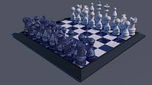
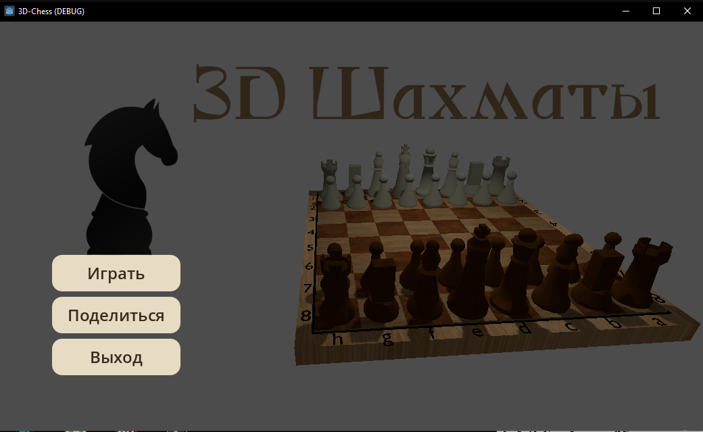
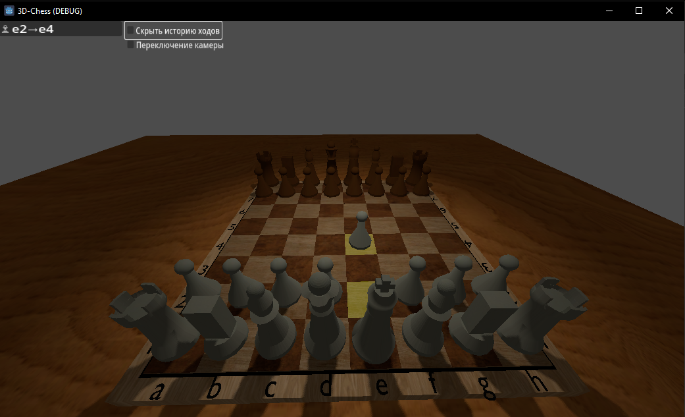
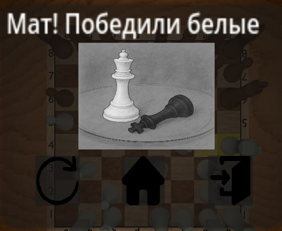

# 3D Шахматы :trophy:

Добро пожаловать в проект 3D шахмат! Эта игра предлагает уникальный и интерактивный опыт игры в шахматы с использованием 3D графики. Игра разработана для того, чтобы сделать классическую стратегическую игру более привлекательной и доступной для игроков всех уровней.



## Описание :sun_with_face:

3D шахматы позволяют игрокам видеть шахматную доску и фигуры в объеме, что улучшает понимание позиции и стратегии. Игра включает в себя различные функции, такие как анализ партий, возможность вращения доски и поддержку виртуальной и дополненной реальности.

## Особенности: shipit:
```
- Уникальный визуальный опыт 3D графика для более привлекательного игрового процесса.
- Интерактивность Возможность вращать доску и приближать фигуры.
- Анализ партий Инструменты для анализа ходов и стратегий.
- Разнообразие дизайна Креативные дизайны фигур и досок.
- Поддержка VR и AR Возможность игры в виртуальной и дополненной реальности.
- Многопользовательский режим Играйте с друзьями в реальном времени.
- Интеграция с ИИ Сложные алгоритмы для создания сильных противников.
```
## Команда разработчиков

- Керенцев Михаил - 3D Моделирование, TeamLead, Risk - manager.
- Носов Владислав - Fullstack - developer(разработка клиентской и серверной частей)
- Козаченко Олег - Backend - developer(разработка серверной части)
- Никитин Илья - Project - manager(ведение документации и github), QA - Tester(тестирование работы программы)

## Установка :bookmark::bookmark::bookmark:

1. Скачайте архив с нашего репозитория. https://github.com/Bidarmuk/3dChess/tree/master
2. Распакуйте его и запустите файл "ch1.exe".

## Фото проекта

### Главное меню :crown:


### Игровое поле


### Окно завершения поединка
